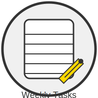

# 🗓️ Weekly Routine Manager
---



---

## 📖 Overview

---
The **Weekly Routine Manager** is a sleek and intuitive desktop application designed to help you manage and organize your weekly routines. Built with Python and the `PySide6` library, this app offers a user-friendly interface for creating, viewing, editing, deleting, importing, and exporting your daily schedules. Whether you're a fan of dark mode or prefer a light theme, this app provides an easy toggle between the two, ensuring a comfortable user experience.

## ✨ Features

- **🗓️ View Routine**: Select a day of the week to view all scheduled activities for that day.
- **➕ Add New Routine**: Easily add new time and activity entries for any specific day.
- **✏️ Edit Routine**: Modify existing time and activity details of a routine.
- **❌ Delete Routine**: Remove specific entries from a day’s routine.
- **📥 Import Routine**: Import routine data from an XML file.
- **📤 Export Routine**: Export routine data to an XML file.
- **🌗 Toggle Dark/Light Mode**: Switch between dark and light themes with a simple click.
- **🚪 Exit**: Quit the application with a single click.

## 🛠️ Prerequisites

Before you can run the application, ensure that you have the following installed:

- **🐍 Python 3.x**: The application is built using Python 3.x.
- **🖥️ PySide6**: This is the primary framework used for the graphical user interface.

You can install the required Python packages by running:

```bash
pip install PySide6 qtpy
```

## 🚀 Getting Started

To start the application, navigate to the project directory and execute the following command:

```bash
git clone https://github.com/mdriyadkhan585/Weekly-Routine-Manager
cd Weekly-Routine-Manager
python main.py
```

This will launch the **Weekly Routine Manager** application.

## 🖥️ Application Layout

The application interface is organized into several sections for ease of use:

### 1. **🔝 Top Bar**
   - **🚪 Exit Button (X)**: Positioned at the top left, this button closes the application.
   - **🌗 Dark/Light Mode Toggle (M)**: Located at the top right, this button toggles between dark and light modes. Long-pressing the button displays a tooltip: "Check Dark/White Mode".

### 2. **🖥️ Main Section**
   - **📅 Day Selector**: A dropdown menu that allows you to select a day of the week to view the routine.
   - **🔍 Show Routine Button**: Displays the activities scheduled for the selected day.
   - **📋 Routine Table**: A table with two columns:
     - **⏰ Time**: Displays the time of each activity.
     - **📝 Activity**: Displays the description of each activity.

### 3. **⬇️ Bottom Buttons**
   - **➕ Add New Routine**: Opens a dialog to add a new routine entry with time and activity. This entry is then added to the table and the database.
   - **❌ Delete Routine**: Opens a dialog to input the row number of the entry you want to delete. The entry is removed from the table and the database.
   - **✏️ Edit Routine**: Opens a dialog to edit the time and activity of a selected row. The edited entry is updated in the table and the database.
   - **📥 Import**: Allows you to import routine data from an XML file, replacing the current data.
   - **📤 Export**: Exports the current routine data to an XML file, which is saved in the `Documents` folder.

## 📝 How to Use the Application

### 🔍 Viewing a Routine
1. **Select a Day**: Use the dropdown menu to select a day.
2. **Show Routine**: Click the "Show Routine" button to display the schedule for the selected day.

### ➕ Adding a New Routine
1. **Add New Routine**: Click the "Add New Routine" button.
2. **Input Details**: In the dialog box, enter the time and activity details.
3. **Save or Cancel**: Click "OK" to add the entry, or "Cancel" to discard it.

```python
# Example of adding a new routine entry
time = "10:00 AM - 11:00 AM"
activity = "🧘 Meditation"
add_routine(time, activity)
```

### ✏️ Editing a Routine
1. **Edit Routine**: Click the "Edit Routine" button.
2. **Select Row**: Enter the row number you wish to edit.
3. **Modify Details**: Update the time and activity.
4. **Save or Cancel**: Click "OK" to save changes, or "Cancel" to discard them.

```python
# Example of editing an existing routine entry
row = 2  # Row number to edit
new_time = "11:00 AM - 12:00 PM"
new_activity = "📚 Study Time"
edit_routine(row, new_time, new_activity)
```

### ❌ Deleting a Routine
1. **Delete Routine**: Click the "Delete Routine" button.
2. **Select Row**: Enter the row number of the entry you wish to delete.
3. **Confirm or Cancel**: Click "OK" to delete, or "Cancel" to keep the entry.

```python
# Example of deleting a routine entry
row_to_delete = 3  # Row number to delete
delete_routine(row_to_delete)
```

### 📤 Exporting a Routine
1. **Export**: Click the "Export" button.
2. **Choose Location**: Select a location in the `Documents` folder to save the XML file.

### 📥 Importing a Routine
1. **Import**: Click the "Import" button.
2. **Select XML File**: Choose the XML file to import. The current routine data will be replaced by the data in the file.

```python
# Example of importing routine data from XML
import_routine("routine_data.xml")
```

### 🌗 Toggling Dark/Light Mode
1. **Toggle Mode**: Click the "M" button in the top right corner to switch between dark and light modes.
2. **Tooltip**: Long-pressing the "M" button displays a tooltip saying "Check Dark/White Mode".

### 🚪 Exiting the Application
1. **Exit**: Click the "X" button in the top left corner to close the application.

## 🗄️ Database Management

The application uses an SQLite database (`routine.db`) to store routine data. The database has a `routine` table with the following structure:

- **day**: The day of the week (e.g., "Monday").
- **time**: The time slot of the activity.
- **activity**: The description of the activity.

When you add, edit, or delete routines in the app, the database is automatically updated.

### SQL Example

```sql
CREATE TABLE routine (
    id INTEGER PRIMARY KEY,
    day TEXT NOT NULL,
    time TEXT NOT NULL,
    activity TEXT NOT NULL
);

-- Insert a new routine
INSERT INTO routine (day, time, activity)
VALUES ('Monday', '08:00 AM - 09:00 AM', '🏋️‍♂️ Gym');

-- Update a routine
UPDATE routine
SET time = '09:00 AM - 10:00 AM', activity = '☕ Coffee Break'
WHERE id = 1;

-- Delete a routine
DELETE FROM routine WHERE id = 1;
```

## 🎨 Customizing Themes

You can further customize the look and feel of the application by modifying the style sheets in the `apply_theme()` method within the `routine_view.py` file. The method defines styling for both dark and light modes.

```python
def apply_theme(dark_mode=True):
    if dark_mode:
        # Set dark theme styles
        self.setStyleSheet("background-color: #2E2E2E; color: white;")
    else:
        # Set light theme styles
        self.setStyleSheet("background-color: white; color: black;")
```

## 🛠️ Dependencies

To ensure everything runs smoothly, make sure you have the following installed:

```bash
pip install PySide6 qtpy
```

## 🚧 Troubleshooting

### Common Issues:
- **App crashes on startup**: Ensure all dependencies are installed correctly.
- **Database not updating**: Check for correct SQL syntax when adding, editing, or deleting entries.
- **Dark/Light mode not toggling**: Verify that the `apply_theme()` method is properly configured.

## 🤝 Contributing

We welcome contributions! If you encounter bugs, feel free to submit an issue or a pull request. 

## 📝 License

This project is licensed under the MIT License. See the `LICENSE` file for more details.

## 📬 Contact

For any queries or support, feel free to reach out to the project maintainers.

---
